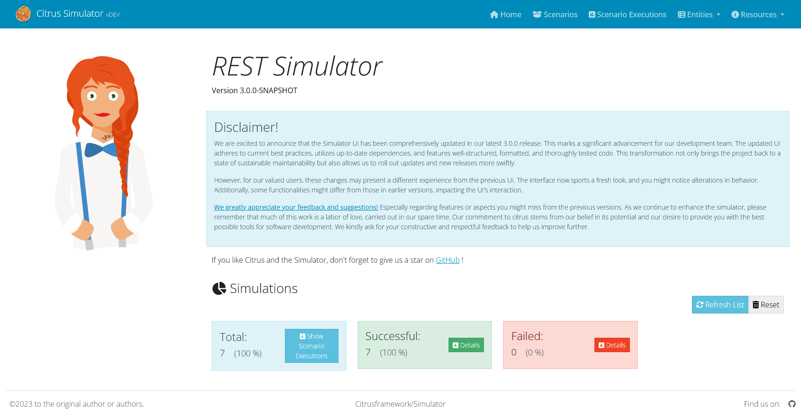

Citrus Simulator ![Logo][1]
================

This is a standalone simulator for different messaging transports such as Http REST, SOAP WebService,
JMS, RMI, SMTP and more.

The simulator provides server APIs for clients and responds with predefined messages according to
defined scenarios. The simulator response logic is very powerful and enables us to simulate any kind of server interface.

The simulator uses [Spring Boot](https://projects.spring.io/spring-boot/) in combination with the test framework [Citrus](https://www.citrusframework.org). You can
code simulator scenarios in Java or XML. Each scenario execution on the simulator is stored to an internal database and can be reviewed via web UI in the browser.

Read the simulator [user manual](https://citrusframework.org/citrus-simulator/) for more information.

Concepts
---------

The Citrus simulator is a normal Spring Boot web application that is started on your local machine. Once started the simulator is capable of handling incoming requests
of different message types and messaging transports. Each incoming request executes a predefined scenario that will create a proper response message for the client. Which scenario to execute 
is identified based on a mapping key that is extracted from the incoming request.

There are multiple ways to identify the simulator scenario from incoming request messages:

* Message-Type: Each request message type (XML root QName) results in a separate simulator scenario
* Content based Xpath: Evaluates Xpath expressions on the request payload and uses the expression result as scenario name
* Content based JsonPath: Evaluates JsonPath expressions on the request payload and uses the expression result as scenario name
* Header value: Evaluates header name on request and uses header value as scenario name
* SOAP action: Evaluates SOAP action header on request and uses the value as scenario name
* REST request mappings: Identifies the scenario based on Http method and resource path on server
* Request mapping annotations: Uses Spring @RequestMapping annotations on scenarios in order to map incoming requests based on request method and/or request path values

The scenario is able to use the full Citrus test framework power in order to create complex execution logic. The response messages can hold dynamic values and the
simulator is able to handle intermediate messages as well as call other APIs within a scenario to perform complex response generating logic. The scenarios are coded in Java classes that use the Citrus test
DSL for defining the simulator scenario steps.

You can use any build system you like when building the simulator application. Here we show how to setup everything using [Gradle](http://gradle.org/) and [Maven](https://maven.apache.org/).

Gradle Quickstart
---------

You can use a usual Spring Boot build script to compile and package the application with Gradle:

```groovy
buildscript {
    repositories {
        mavenCentral()
    }
    dependencies {
        classpath("org.springframework.boot:spring-boot-gradle-plugin:2.1.6.RELEASE")
    }
}

apply plugin: 'java'
apply plugin: 'eclipse'
apply plugin: 'idea'
apply plugin: 'org.springframework.boot'

jar {
    group = "com.consol.citrus.simulator"
    baseName = 'citrus-simulator-sample'
    version =  '1.1.0-SNAPSHOT'
}

repositories {
    mavenCentral()
}

sourceCompatibility = 1.8
targetCompatibility = 1.8

dependencies {
    implementation("org.springframework.boot:spring-boot-starter-web")
    implementation("com.consol.citrus:citrus-simulator-starter:1.1.0-SNAPSHOT")
    testImplementation("junit:junit")
}
```

Maven Quickstart
---------

When choosing Maven as build tool the pom file is a normal Spring Boot project with all dependencies and plugins.

```xml
<?xml version="1.0" encoding="UTF-8"?>
<project xmlns="http://maven.apache.org/POM/4.0.0"
         xmlns:xsi="http://www.w3.org/2001/XMLSchema-instance"
         xsi:schemaLocation="http://maven.apache.org/POM/4.0.0 http://maven.apache.org/xsd/maven-4.0.0.xsd">
  <modelVersion>4.0.0</modelVersion>

  <groupId>com.consol.citrus</groupId>
  <artifactId>citrus-simulator-sample</artifactId>
  <name>${project.artifactId}</name>
  <version>1.0.0</version>

  <properties>
    <java.version>11</java.version>
    <project.build.sourceEncoding>UTF-8</project.build.sourceEncoding>
    <project.reporting.outputEncoding>UTF-8</project.reporting.outputEncoding>
    <citrus.simulator.version>1.1.0-SNAPSHOT</citrus.simulator.version>
    <spring.boot.version>2.1.6.RELEASE</spring.boot.version>
  </properties>

  <dependencyManagement>
    <dependencies>
      <dependency>
        <groupId>org.springframework.boot</groupId>
        <artifactId>spring-boot-dependencies</artifactId>
        <version>${spring.boot.version}</version>
        <type>pom</type>
        <scope>import</scope>
      </dependency>
    </dependencies>
  </dependencyManagement>

  <dependencies>
    <dependency>
      <groupId>org.springframework.boot</groupId>
      <artifactId>spring-boot-starter-web</artifactId>
    </dependency>

    <!-- Citrus Simulator -->

    <dependency>
      <groupId>com.consol.citrus</groupId>
      <artifactId>citrus-simulator-starter</artifactId>
      <version>${citrus.simulator.version}</version>
    </dependency>
  </dependencies>

  <build>
    <plugins>
      <plugin>
        <artifactId>maven-compiler-plugin</artifactId>
        <version>3.7.0</version>
        <configuration>
          <encoding>${project.build.sourceEncoding}</encoding>
          <source>${java.version}</source>
          <target>${java.version}</target>
        </configuration>
      </plugin>

      <plugin>
        <groupId>org.apache.maven.plugins</groupId>
        <artifactId>maven-war-plugin</artifactId>
        <version>3.1.0</version>
        <configuration>
          <failOnMissingWebXml>false</failOnMissingWebXml>
        </configuration>
      </plugin>

      <plugin>
        <groupId>org.springframework.boot</groupId>
        <artifactId>spring-boot-maven-plugin</artifactId>
        <version>${spring.boot.version}</version>
        <configuration>
          <fork>true</fork>
        </configuration>
      </plugin>
    </plugins>
  </build>

</project>
```

Simulator logic
---------

As the simulator is a normal Spring boot application we just add a usual main class.

```java
package com.consol.citrus.simulator;

import org.springframework.boot.SpringApplication;
import org.springframework.boot.autoconfigure.SpringBootApplication;

@SpringBootApplication
public class Simulator {

    public static void main(String[] args) {
        SpringApplication.run(Simulator.class, args);
    }
}
```

In addition to that we should define one to many simulator scenarios that execute when requests are received.

```java
package com.consol.citrus.simulator;

import com.consol.citrus.http.message.HttpMessage;
import com.consol.citrus.simulator.scenario.*;
import org.springframework.http.HttpStatus;

@Scenario("DEFAULT_SCENARIO")
public class DefaultScenario extends AbstractSimulatorScenario {

    @Override
    public void run(ScenarioDesigner designer) {
        designer.echo("Default scenario executed!");

        designer.send()
                .message(new HttpMessage("Welcome to the Citrus simulator")
                .status(HttpStatus.OK));
    }
}
```

Run as web application
---------

Now you can build and run the simulator application.

*Gradle*
```bash
./gradlew build bootRun
```

*Maven*
```bash
mvn install spring-boot:run
```

You will see the application starting up. Usually you will see some console log output. The web server should start within seconds. Once the application is up and running
you can open your browser and point to [http://localhost:8080](http://localhost:8080). You will see the very basic simulator user interface. For a more detailed user interface please
follow the [chapter user-interface](https://citrusframework.org/citrus-simulator#user-interface).

The REST default scenario that we have added is accessible using [http://localhost:8080/services/rest/](http://localhost:8080/services/rest/). You will see the default output `Welcome to the Citrus simulator`
coming from default scenario execution.

That's it you are ready to use the Citrus simulator now.

User interface
---------

The simulator application is started as a Spring boot web application. If you open your browser and point to the running simulator instance at `http://localhost:8080`
you will see a user interface that displays information about the simulator.



The simulator dashboard gives you a quick overview of the numbers and facts on your simulator project. Users can then access an administrative web user interface in order to 
review the simulator status and list all executed scenarios and their outcome. The simulator Angular2 user interface comes as dependency that is added to the simulator project. 
In Maven we simply add the following dependency:

```xml
<dependency>
  <groupId>com.consol.citrus</groupId>
  <artifactId>citrus-simulator-ui</artifactId>
  <version>${citrus.simulator.version}</version>
</dependency>
```

To understand the full capabilities of the UI please read the [chapter user-interface](https://citrusframework.org/citrus-simulator#user-interface) in reference manual.

Features
---------

* Implements any of the interfaces: SOAP (WSDL), REST, JMS, File
* Powerful response simulation (dynamic identifiers, fault simulation, value extraction, etc.)
* Easy message definition (Citrus Java DSL)
* XSD schema validation of incoming requests
* JSON message format handling
* Powerful header support (SOAP Action, SOAP header fragments, Http headers)
* Auto generate simulator from Swagger Open API specifications
* Auto generate simulator from SOAP WSDL files

Samples
---------

Documentation can only provide theoretical insights of what the application is capable to provide. Good sample projects
help both beginners and experts to reach complete understanding of how the simulator works in different environments.

Following from that we try to provide sample project that demonstrate the simulator usage in real world examples. Please see the following
sample projects with complete code available in [simulator-samples](simulator-samples).

*REST sample*

* Http REST: [simulator-samples/sample-rest](simulator-samples/sample-rest)
* Auto generated from swagger: [simulator-samples/sample-swagger](simulator-samples/sample-swagger)

*SOAP sample*

* Http SOAP: [simulator-samples/sample-ws](simulator-samples/sample-ws)
* Http SOAP client: [simulator-samples/sample-ws-client](simulator-samples/sample-ws-client)
* Auto generated from WSDL: [simulator-samples/sample-wsdl](simulator-samples/sample-wsdl)

*JMS sample*

* JMS synchronous: [simulator-samples/sample-jms](simulator-samples/sample-jms)
* JMS asynchronous: [simulator-samples/sample-jms-fax](simulator-samples/sample-jms-fax)

*Mail sample*

* Mail endpoint simulator: [simulator-samples/sample-mail](simulator-samples/sample-mail)

*Combined sample*

* Http REST and JMS combined: [simulator-samples/sample-combined](simulator-samples/sample-combined)

Information
---------

Read the simulator [user manual](https://citrusframework.org/citrus-simulator/) for detailed instructions and features.
For more information on Citrus see [citrusframework.org][2], including a complete [reference manual][3].

 [1]: https://citrusframework.org/img/brand-logo.png "Citrus"
 [2]: https://citrusframework.org
 [3]: https://citrusframework.org/reference/html/
